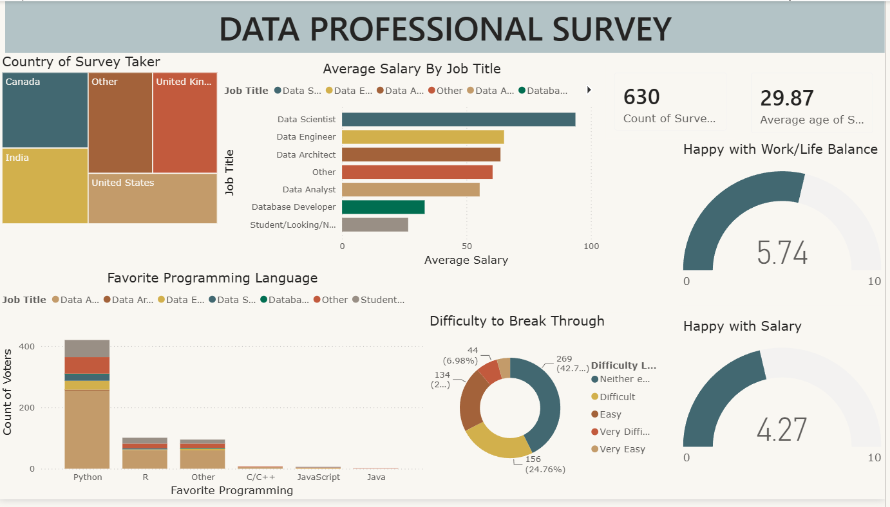
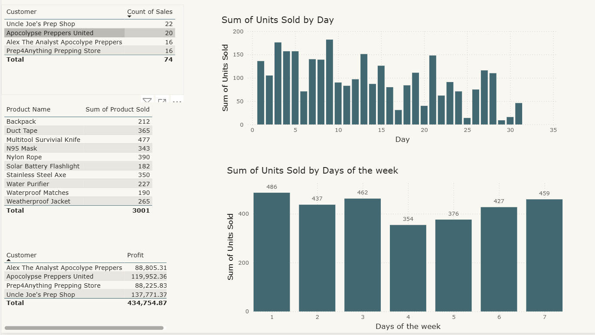

# 📊 Data Professional Survey & Sales Analytics Dashboard

A comprehensive Power BI business intelligence project featuring dual dashboards designed to analyze industry trends among data professionals and monitor retail sales and profitability performance. Built using advanced DAX styling, star-schema data modeling, and custom visualization configurations.

---

## 🚀 Key Features & Dashboards

### 1. Data Professional Survey Dashboard
An executive-level demographic and occupational analysis mapping out insights from **630 survey participants** with an average age of **29.87 years**. 

* **Global Footprint:** Geospatial breakdown tracking respondents across Canada, India, the United Kingdom, the United States, and other regions.
* **Compensation & Role Analysis:** Comparative tracking of the average salary by job title, identifying Data Scientists as the top earners.
* **Tech Stack Popularity:** Granular distribution mapping favorite programming languages across roles, highlighting massive dominance in Python, followed by R.
* **Sentiment Metrics:** Gauge indicators scoring average Work/Life Balance (5.74 / 10) and Salary Satisfaction (4.27 / 10).
* **Industry Accessibility:** Donut chart breakdown quantifying perceived difficulty tiers for entering the data industry field.

#### 📈 Survey Dashboard Preview

---

### 2. Retail Sales & Profitability Dashboard
A operational reporting view built to evaluate transaction highpoints, customer lifetime value, and distribution timelines.

* **High-Value Client Tracking:** Table metrics sorting top institutional buyers (e.g., *Uncle Joe's Prep Shop*, *Apocalypse Preppers United*) ranked by total units purchased and cumulative net profit ($434,754.87 total portfolio value).
* **Inventory Demand Lifecycle:** Direct product line rankings tracking volume movement (such as 365 units of Duct Tape, 477 Multitool Survival Knives).
* **Temporal Patterns:** Bar chart aggregations tracking product volumes shifting daily across a 31-day cycle, paired with a specialized Day-of-the-Week breakdown (Days 1–7) showing peak periods.

#### 📈 Sales Dashboard Preview

---

## 🛠️ Tech Stack & DAX Techniques Applied

* **BI Platform:** Power BI Desktop 
* **Data Modeling:** Analytical star-schemas optimizing transaction relationships.
* **DAX Formulas Applied:** Custom measures utilizing conditional filtering, key indicator profiling, and arithmetic aggregation overrides.
* **UI/UX Customization:** Custom color themes, card groupings for KPI displays, responsive gauges, and integrated tooltips.
